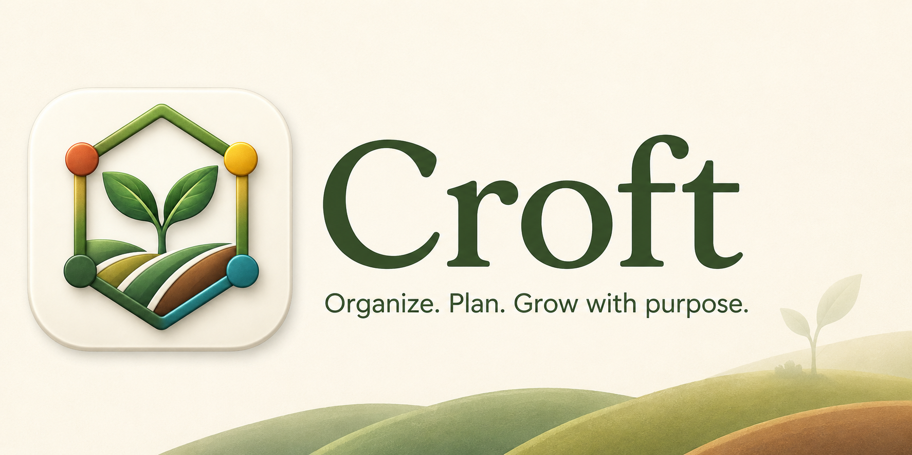
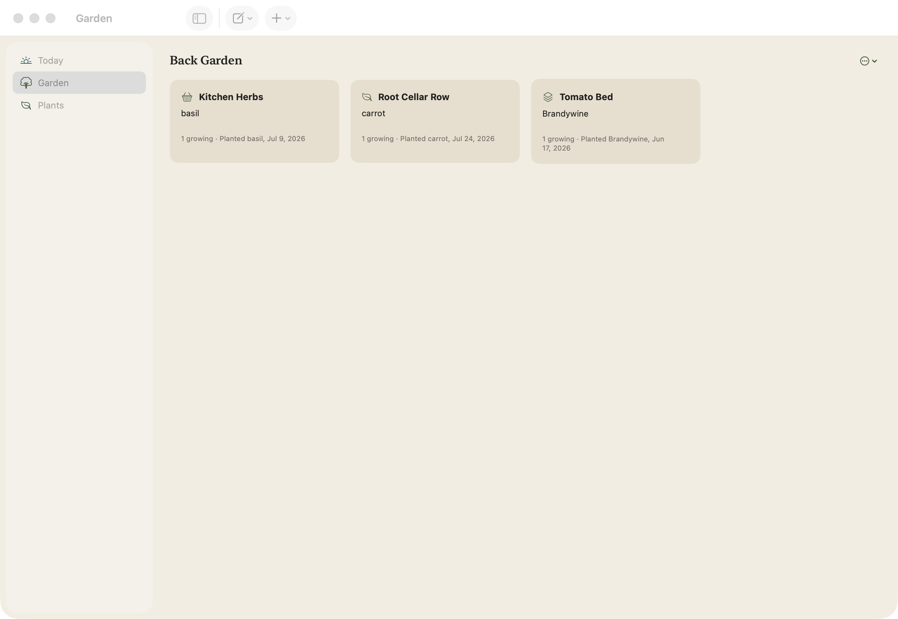
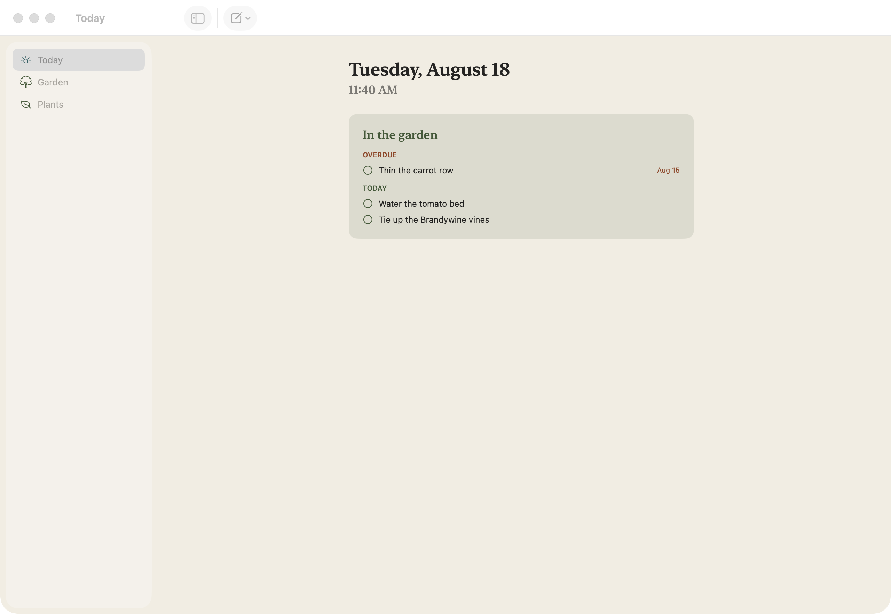
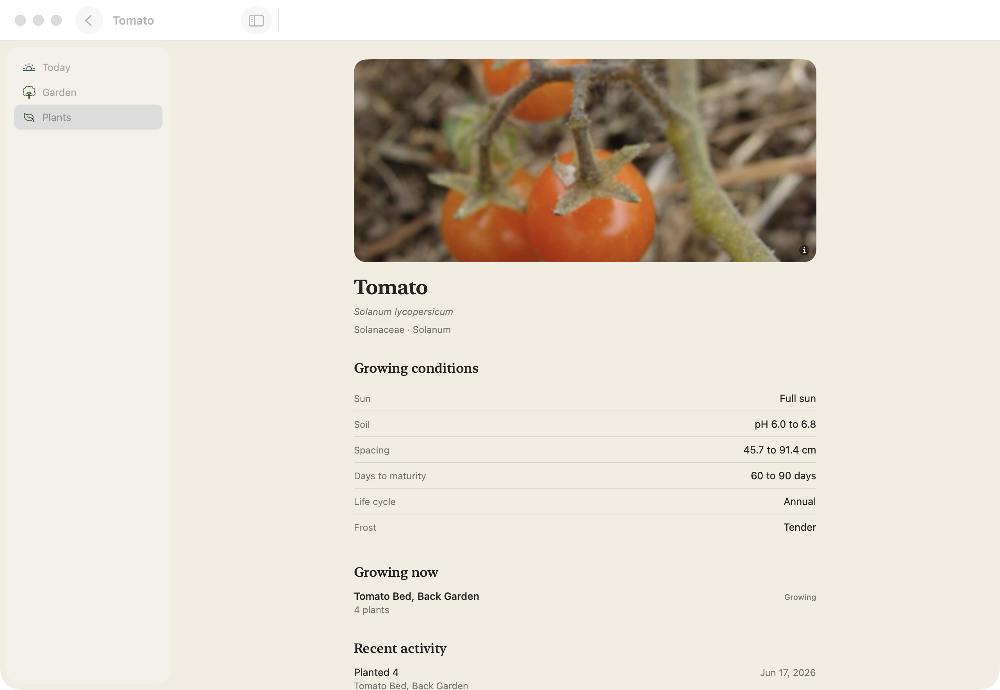
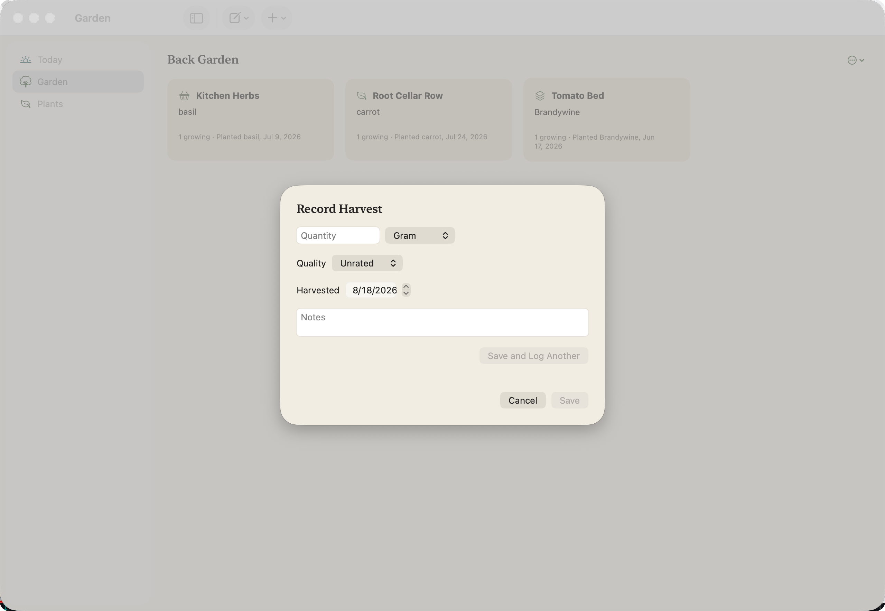

[](https://github.com/DisplacedForest/Croft/actions/workflows/ci.yml)
[](https://github.com/DisplacedForest/Croft/releases)
[](LICENSE)


Open-source, local-first garden operating system built on a horticultural knowledge graph. Native Swift and SwiftUI for macOS.

Croft models a real garden and the knowledge to run it, entirely on your machine. Everything lives in a local SQLite database: no account, no sync service, no network dependency. And the knowledge is accountable: plant relationships cite their sources, so unsourced folklore doesn't get in.



## Install

Download `Croft-<version>.dmg` from the [latest release](https://github.com/DisplacedForest/Croft/releases/latest), open it, and drag Croft into Applications. Builds are signed and notarized, so macOS opens them without warnings. Requires macOS 15 or later.

## What Croft does

- Knows plants. Family down to cultivar, with cultivation profiles covering sun, water, soil pH, spacing, germination, sowing, frost tolerance, and days to maturity: 32 common crops and over a thousand cultivars, bundled offline.
- Knows what threatens them. The major home-garden pests and diseases, what they attack, which cultivars resist them, and identification imagery.
- Maps your garden the way it's actually laid out. Properties contain gardens, gardens contain growing areas and beds (raised, in-ground, or container), and every planting is a real crop in a real bed, traced back to the seed lot or starter batch it came from.
- Remembers what happened. Observations with photos, harvests, and tasks, each connected to the planting, bed, or plant it belongs to.
- Captures fast. Add a planting, log an observation, record a harvest, manage tasks, or add a seed lot from wherever you are, keyboard friendly and prefilled with the current date and your last-used bed and unit.
- Starts your day. A Today screen with local weather and the garden tasks that are due or overdue.

Plant pages cover everything in the bundled catalog: browse, search, and per-plant detail with growing conditions, cultivars, threats, and imagery.

The knowledge snapshot is imported deterministically from pinned, cited sources; [knowledge/](knowledge/) documents how it's built. Bundled imagery comes from Wikimedia Commons, iNaturalist, and Flickr under public domain, CC0, and CC BY licenses, with per-image attribution in [knowledge/ATTRIBUTION.md](knowledge/ATTRIBUTION.md).

## Screenshots





## Architecture

One typed knowledge graph over SQLite ([GRDB](https://github.com/groue/GRDB.swift)). Entities and relationships carry provenance and confidence, single-cardinality edges are enforced with partial unique indexes, and every schema change lands as a migration with preservation tests. The `CroftCore` package splits into `Domain`, `Persistence`, `Graph`, `Knowledge`, and feature modules under `Core/`.

## Building from source

Requires macOS with Xcode 26 or later and [mise](https://mise.jdx.dev).

```
mise install
mise run generate
open Croft.xcodeproj
```

The Xcode project is generated from `project.yml` with XcodeGen and is not checked in. Regenerate it after changing `project.yml`. The macOS app target is `Croft-macOS`; `mise run build` also rebuilds the bundled knowledge snapshot.

## Verify

```
mise run check
```

Runs formatting, lint, the package tests, and the macOS app build. `mise run check-fast` skips the app build for tight iteration; the pre-push gate is the full check. `mise run ci` adds the runtime design-token resolution tests and is exactly what CI runs.

## License

MIT. See [LICENSE](LICENSE).
